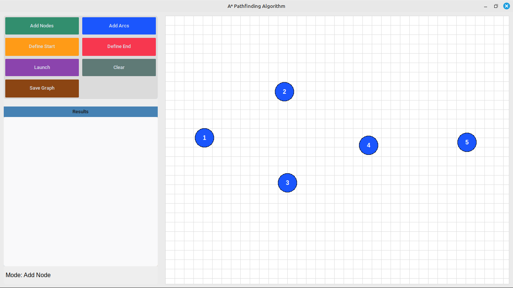
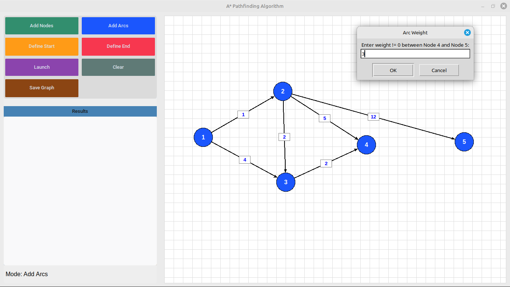
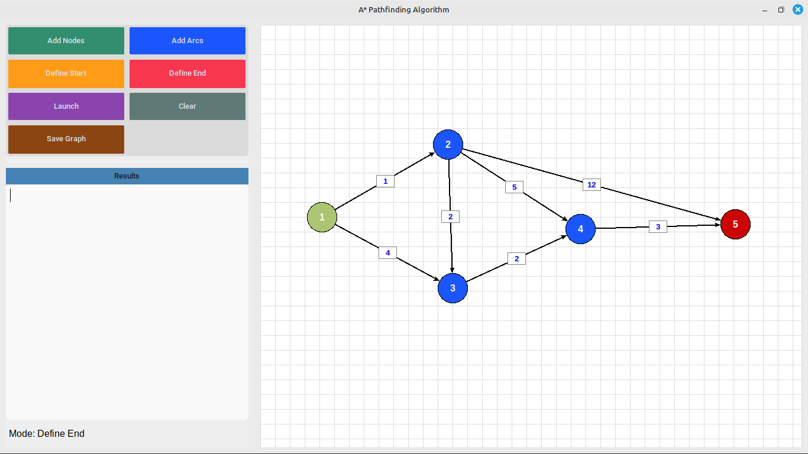
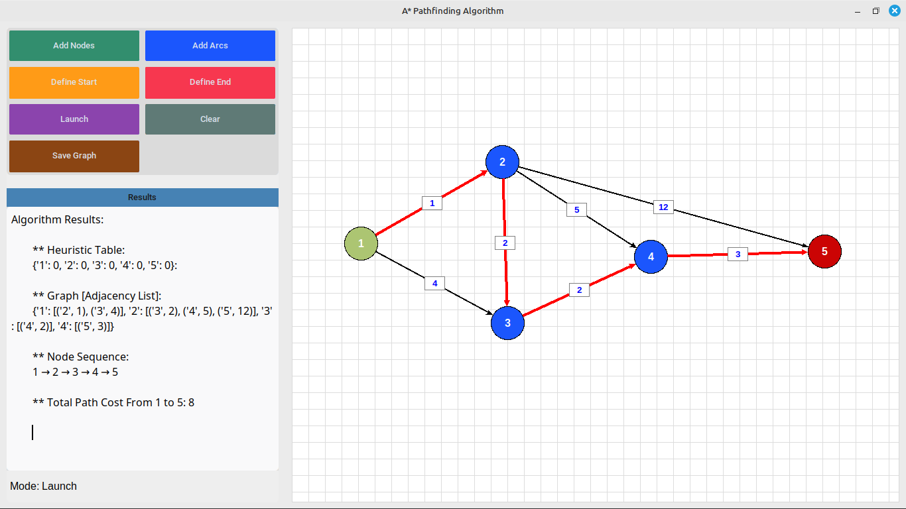

As part of my final year project, I built a pathfinding solution in Python based on an algorithm (a*) that finds the shortest path in a graph. This algorithm performs very well and is faster compared to others like Dijkstra's.

---

## Screenshots

#### Define node  

#### Define edges with weights  

#### Define start and end points for the graph  

#### Run the A* algorithm  

---

## What You Need

**Theoretical part:**  
You need to understand graph theory — what graphs are, nodes, types of graphs, and more.  
Also, learn how the A* algorithm works, then start implementing it using pure Python.

**Technical part:**  
You should know basic Python and Tkinter (a library to make desktop apps).  
You can also use CustomTkinter, which is built on Tkinter and offers a better user interface.

---

## Resources

- YouTube video: [https://youtu.be/dEg6g2NRYwc?si=fxnC25UkTRWQTIA5](https://youtu.be/dEg6g2NRYwc?si=fxnC25UkTRWQTIA5)  
- Website tutorial: [https://www.datacamp.com/fr/tutorial/a-star-algorithm](https://www.datacamp.com/fr/tutorial/a-star-algorithm)

**made with ❤️ by <a href="https://www.linkedin.com/in/abdellah-karani-965928294/">AbdellahKarani</a>**

